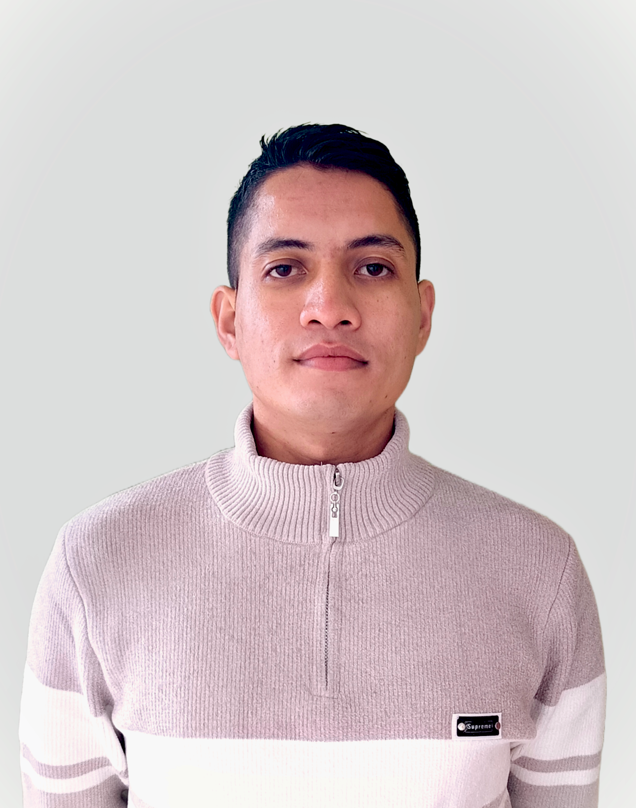

# Hi there! 👋 I'm Bishal Budha  

<table>
  <tr>
    <td>
      
    </td>
    <td>
      

      I'm a passionate physics graduate from <b>Trichandra Multiple Campus, Tribhuvan University</b>, Kathmandu, Nepal.  
      Currently, I'm engaged in research within the fields of <b>biophysics</b> and <b>medical physics</b>, aiming to explore innovative applications of <b>quantum physics</b> and <b>machine learning</b> in healthcare.
      

    </td>
  </tr>
</table>

### 🔬 Research Interests  
- **Quantum physics & machine learning** in drug discovery and cancer treatment  
- **Biophysics & medical physics** applications  
- Exploring the potency of **phytochemicals** as alternatives to synthetic drugs  
- **Deep learning & AI** applications in physics  
- **Web development & UI/UX design**  

### 🎯 Career Aspiration  
Aspiring to pursue a **PhD in physics**, with a focus on integrating **computational methods**, **quantum physics**, and **machine learning** in solving real-world scientific problems.  

### 📫 Connect with Me  
📘 **ResearchGate**: [Bishal Budha](https://www.researchgate.net/profile/Bishal-Budha-2?ev=hdr_xprf)  
🐦 **Twitter/X**: [@bbc_463](https://x.com/bbc_463)  
🔗 **LinkedIn**: [Bishal Budha](https://np.linkedin.com/in/bishalbudha/)  
🟢 **ORCID**: [0009-0002-9467-565X](https://orcid.org/0009-0002-9467-565X)  
📸 **Instagram**: [@bbc_463](https://www.instagram.com/bbc_463/)  

### 💡 Let's Collaborate!  
I’m open to collaborations in **biophysics**, **machine learning**, and **quantum physics applications**. Feel free to reach out!  

